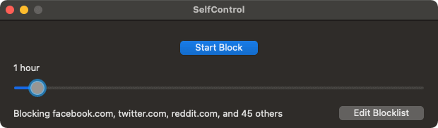

# [SelfControl][website]

    

## About

SelfControl is a free and open-source application for macOS that lets you block **your own** access to distracting websites, your mail servers, or anything else on the Internet. Just set a period of time to block for, add sites to your blocklist, and click "Start Block". Until that timer expires, you will be unable to access those sites—even if you restart your computer or delete the application.

## Credits

Developed by [Charlie Stigler](http://charliestigler.com), [Steve Lambert](http://visitsteve.com), and [others](https://github.com/SelfControlApp/selfcontrol/graphs/contributors). Your contributions very welcome!

SelfControl is now available in 12 languages thanks to [the fine translators credited here](https://github.com/SelfControlApp/selfcontrol/wiki/Translation-Credits).

## License

SelfControl is free software under the GPL. See [this file](./COPYING) for more details.

## Building For Development

Users should always download the latest version of SelfControl from [our website][website]. If you want to contribute to SelfControl, you'll need to learn to build it for development. This can only be done on a Mac running a modern version of macOS.

1. Clone the SelfControl repo from GitHub.
2. Make sure you have a recent version of Xcode and the Xcode command-line tools installed.
3. Install [CocoaPods](https://cocoapods.org/): `sudo gem install cocoapods`
4. Install the SelfControl dependencies using CocoaPods: `pod install`
5. Open the `selfcontrol.xcworkspace` file (**NOT** `selfcontrol.xcodeproj`)
6. Build and run (you may need to update/remove code signing settings to make it build properly)

[website]: https://selfcontrolapp.com/
